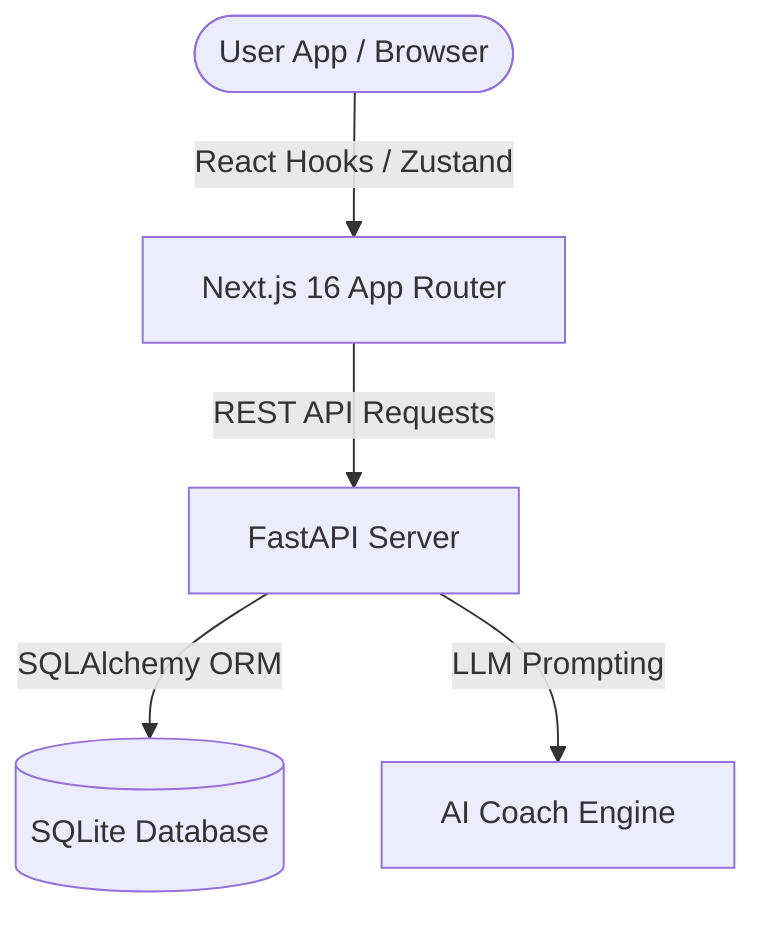

# 🌱 MamaGreen — Carbon Footprint Tracker & Reducer

[](https://nextjs.org/)
[](https://fastapi.tiangolo.com/)
[](https://www.sqlite.org/)
[](https://www.docker.com/)

> Develop a functional application that allows individuals to track, calculate, and systematically reduce their daily environmental footprint.

MamaGreen (formerly Eco Traveler) is a premium, state-of-the-art sustainability and daily mobility application designed to empower individuals to take direct control of their carbon footprint. Similar in feel to premium apps like **Uber**, **Apple Fitness**, and **Stripe**, MamaGreen makes tracking commute impact professional, beautiful, and deeply actionable.

---

## 🚀 Key Features

### 1. 📊 Track
*   **Daily Commute Logger**: Log details of your daily trips (distance, transportation mode).
*   **Active Streak Tracker**: Build healthy habits with daily commute streaks.
*   **Interactive History**: Monitor logs, dates, and progression metrics over time.

### 2. 🧮 Calculate
*   **Precise Carbon Engine**: Translates transport choices (walking, cycling, bus, metro, car) into exact CO2 savings.
*   **Financial Savings Tracker**: Visualizes money saved by choosing transit over passenger cars (incorporating base fares and running rates).
*   **Physical Health Insights**: Automatically calculates calories burned during active commutes.
*   **EcoHealth Leveling**: Maps user scores (0-100) to professional sustainability badges like **Transit Champion** or **Carbon Saver**.

### 3. 📉 Reduce
*   **Multi-Modal Route Planner**: Compares multiple routes and transportation modes side-by-side using carbon-efficiency sorting.
*   **AI Sustainability Coach**: A tailored conversational interface delivering contextual recommendations based on recent travel patterns.
*   **Gamified Challenges**: Jointly tackle community and solo challenges (e.g., "Active Week", "Bus Commuter") to earn XP and level up.
*   **Virtual Sprout Pet**: Watch your virtual eco-pet grow from a tiny seed into a large tree as you accumulate carbon-savings.

---

## 🛠️ System Architecture

MamaGreen uses a modern decoupled architecture:



---

## 📁 Repository Structure

```text
MamaGreen/
├── backend/                  # FastAPI Python backend
│   ├── main.py               # API routes, middleware, and CORS configuration
│   ├── models.py             # SQLAlchemy database tables (User, Trip, Challenges, etc.)
│   ├── ai_coach.py           # AI Coach system rules & recommendation compiler
│   ├── database.py           # SQLite setup & session generator
│   ├── Dockerfile            # Hugging Face Spaces optimized Docker script
│   └── requirements.txt      # Python dependencies
├── src/                      # Next.js 16 React frontend
│   ├── app/                  # App Router views (dashboard, coach, routes, etc.)
│   ├── components/           # Reusable UI widgets (ScoreGauge, SproutPet, LayoutWrapper)
│   ├── store/                # Zustand stores (global user state & auth persistence)
│   ├── utils/                # Pure mathematical calculations and formatters
│   └── tests/                # Jest / ts-jest unit test suites
└── package.json              # Node.js dependencies & scripts
```

---

## 💻 Local Setup & Development

### Backend Setup (FastAPI)

1. Navigate to the `backend/` directory:
   ```bash
   cd backend
   ```
2. Create and activate a Python virtual environment:
   ```bash
   python -m venv venv
   # On Windows
   venv\Scripts\activate
   # On macOS/Linux
   source venv/bin/activate
   ```
3. Install dependencies:
   ```bash
   pip install -r requirements.txt
   ```
4. Run the development server (runs on port `8000`):
   ```bash
   uvicorn main:app --reload --port 8000
   ```

### Frontend Setup (Next.js)

1. Navigate to the root directory and install dependencies:
   ```bash
   npm install
   ```
2. Start the development server (runs on port `3000`):
   ```bash
   npm run dev
   ```
3. Open [http://localhost:3000](http://localhost:3000) to view the application.

---

## 🧪 Testing

The frontend utility functions are fully unit tested using **Jest** and **ts-jest**:

To run the complete test suite:
```bash
npm run test
```

---

## 🐳 Deployment

### Frontend (Vercel)
The Next.js application is pre-configured for seamless production builds:
*   Imports and exports are statically resolved.
*   Run the production build check locally:
    ```bash
    npm run build
    ```

### Backend (Hugging Face Spaces + Docker)
The backend includes a dedicated `Dockerfile` optimized for Hugging Face Spaces:
*   Configured to expose port `7860`.
*   Includes permissions initialization for UID `1000` (which ensures that the SQLite database can write journal logs inside the container).

To build and run the Docker container locally:
```bash
cd backend
docker build -t mamagreen-backend .
docker run -p 7860:7860 mamagreen-backend
```
